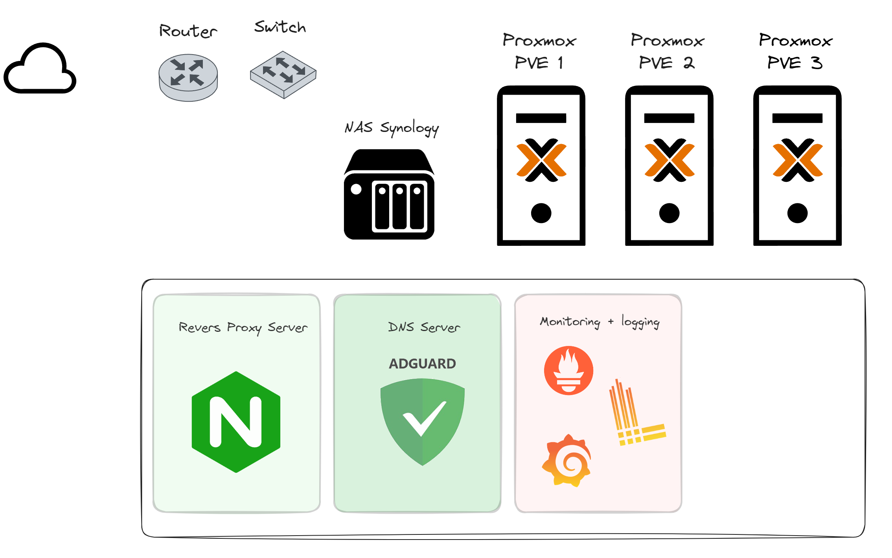

# Infrastructure as code (IaC)

## Experiments on homelab management

General infrastructure and scheme (excalidraw image)

Base image for gitlab ci https://github.com/akmalovaa/iac-tools

### LXC

> LXC  is the minimum unit in my home laboratory (equivalent pod in k8s)

LXC - A Proxmox container is a type of virtualization that allows you to run applications within isolated environments on a Proxmox Virtual Environment (PVE) host. LXC Proxmox containers share the host system’s kernel but maintain their separate user space, making them lightweight. They’re great for deploying applications with less total overhead than virtual machines, which allows for more efficient resource usage.

- Easy to create, delete, backup
- Auto transfer to live node in Proxmox Cluster
- Another layer of security
- Easier to maintain (if something breaks, it will be inside only this application)

LXC resources are more convenient to use and manage instead of lifting a virtual machine and deploying everything in one place

For convenience, i use:
- **Base template:** `ubuntu-24.04-standard_24.04-1_amd64.tar.zst`
- **VMID:** Proxmox Container ID use the range from 100 to 255 as the ID, for the convenience of assigning and controlling an IP address
- **IP address example:** 10.0.0.$VMID

## Ansible

for create LXC, install soft, infrastructure preparation
Gitlab is used for deployment

## Prepare

### Install Proxmox and create user for Ansible

### Create a LXC and configure Gitlab|Github runner

## Services

### Proxy server

[Traefik](https://github.com/traefik/traefik) 

Alternatives:
- [caddy](https://github.com/caddyserver/caddy)
- [nginx proxy manager](https://github.com/NginxProxyManager/nginx-proxy-manager)

### DNS

[blocky](https://github.com/0xERR0R/blocky)

Alternatives:
- [AdGuardHome](https://github.com/AdguardTeam/AdGuardHome)
- [pi-hole](https://github.com/pi-hole/pi-hole)